# ITMD-521 Chapter-03 Lab

You will copy this template file to your own private GitHub repo provided.  Under your itmd-521 folder you will create a sub-folder named: **labs**.  Under that folder create a sub-folder named: **chapter-03**.  In that folder place this Readme.md

## Objectives

- Demonstrate loading of datasources into a dataframe
- Demonstrate transformation of the dataframe content
- Demonstrate display of the transformed dataframe
- Demonstrate building your own Java or Python based Spark program

## Qiang Bao

### Labs

Using either the Python or Java code, you will run an execute all of the labs provided in the book sample code and display the output via screenshot

#### Lab 200

Place screenshot of a successful execution output of the results of the `df.show()` and or any `system.out.println()` commands.

Screenshot here
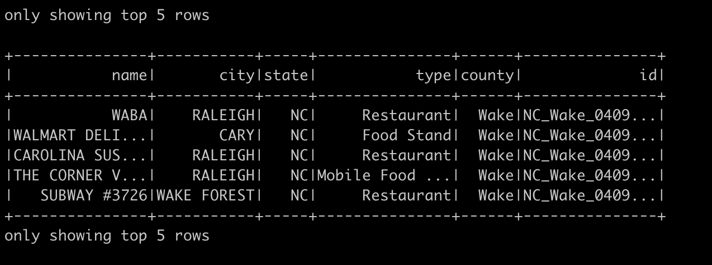

#### Lab 210

Place screenshot of a successful execution output of the results of the `df.show()` and or any `system.out.println()` commands.

Screenshot here
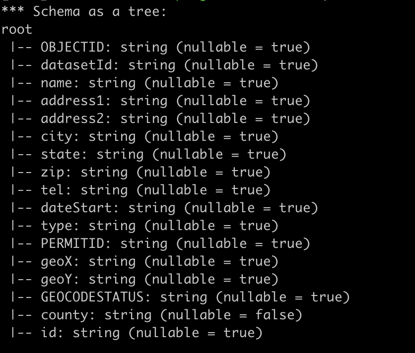

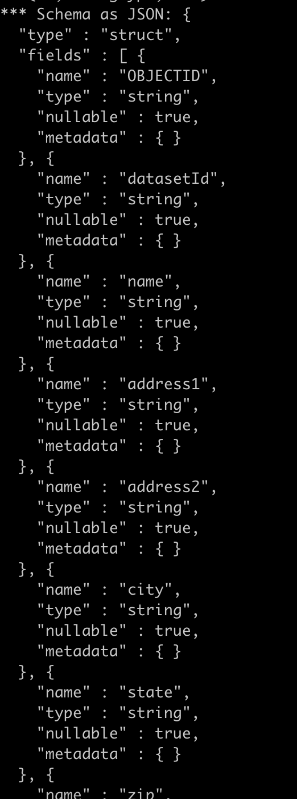

#### Lab 220

Place screenshot of a successful execution output of the results of the `df.show()` and or any `system.out.println()` commands.

Screenshot here
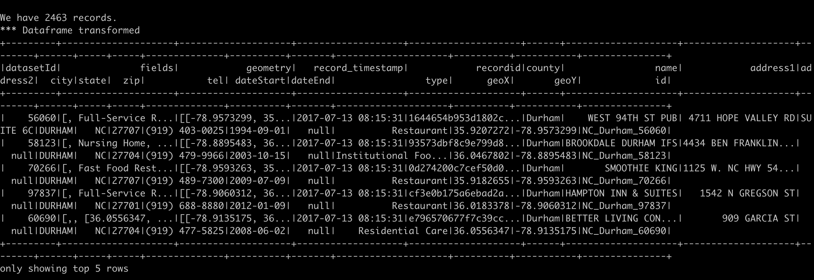

#### Lab 230

Place screenshot of a successful execution output of the results of the `df.show()` and or any `system.out.println()` commands.

Screenshot here

#### Lab 300

Place screenshot of a successful execution output of the results of the `df.show()` and or any `system.out.println()` commands.

Screenshot here

#### Lab 310

Place screenshot of a successful execution output of the results of the `df.show()` and or any `system.out.println()` commands.

Screenshot here
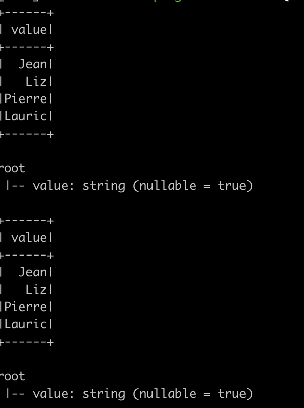

#### Lab 320

Place screenshot of a successful execution output of the results of the `df.show()` and or any `system.out.println()` commands.

Screenshot here
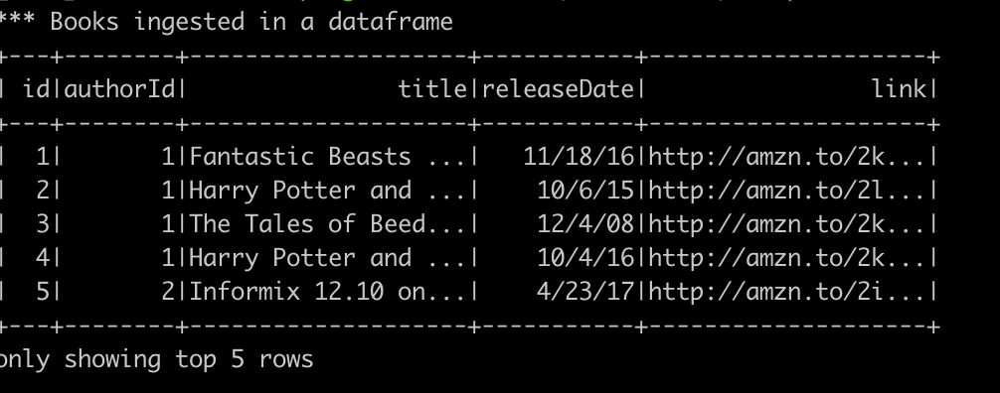
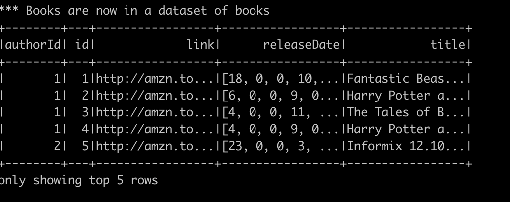
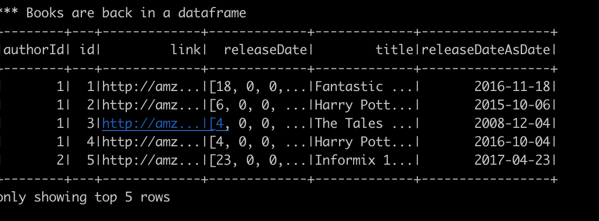

#### Lab 321

Place screenshot of a successful execution output of the results of the `df.show()` and or any `system.out.println()` commands.

Screenshot here
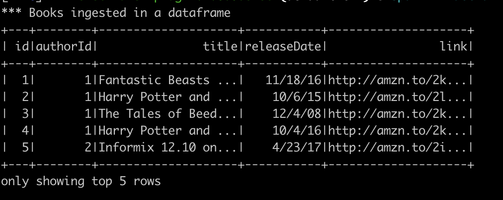
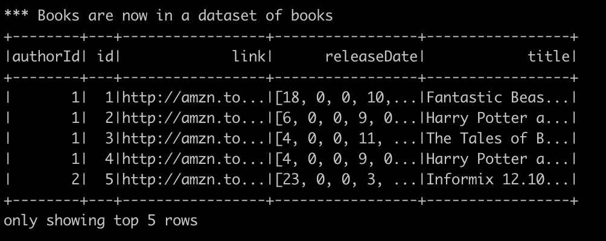
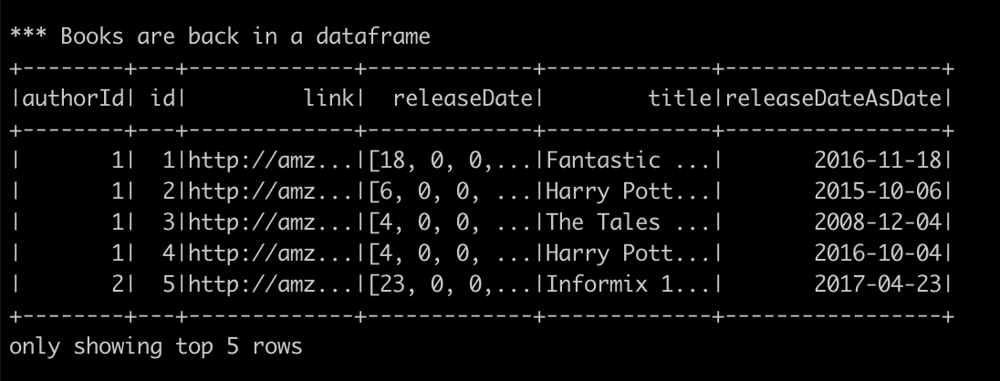

#### Summary Project

Using the two sample .csv files provided in this repo, add them to your own private repo and to your Virtual Machine.  Place a screenshot below any of the elements asking to display results (`df.show()`). Build a single Java or Python Spark program that will:

- Ingest company-data.csv to a dataframe
  - Use a `df.show()` command to display the content of the dataframe
- Ingest additional-company-data.csv to a dataframe
  - Use a `df.show()` command to display the content of the dataframe
- Create a dataframe each to contain the data read in from the CSV files
- Within those dataframes, create a new column named **fullname**, that includes a combination of the firstname and lastname fields, separated by a space.  
  - For example: Hajek, Jeremy becomes Jeremy Hajek
- Remove the **ssn** column from the dataframes (not real SSNs)
- Union the results
- Use a `df.show()` command to display the modified dataframe and the union
- Use the `printSchema()` on the dataframe to display the schema
  - [Spark Java Dataset API for .printSchema()](https://spark.apache.org/docs/latest/api/java/org/apache/spark/sql/Dataset.html#printSchema-- "Spark Java API for printSchema")
  - [Python Dataframe API for .printSchema()](https://spark.apache.org/docs/latest/api/python/pyspark.sql.html?highlight=printschema#pyspark.sql.DataFrame.printSchema "Python Spark API for printSchema")
- Using the Spark API - sort the combined dataframe via the content of the **status** column using the `.sort()` method. Display the sorted content using the `df.show()` command
  - [Spark Python Dataframe API](https://spark.apache.org/docs/latest/api/python/pyspark.sql.html?highlight=printschema#pyspark.sql.DataFrame "Spark Dataframe API webpage")
  - [Spark Java Dataset API](https://spark.apache.org/docs/latest/api/java/org/apache/spark/sql/Dataset.html "Spark Dataset API webpage")

### Deliverable

In your private repo you push the single Java or Python file you have written and the .csv files to fulfill the listed deliverables
Submit the URL to this page to Blackboard as your deliverable
