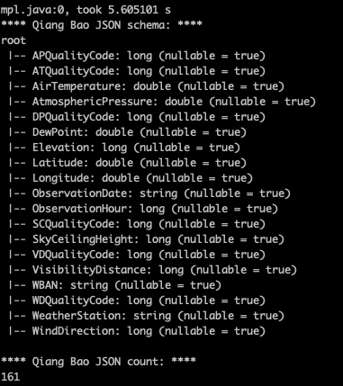
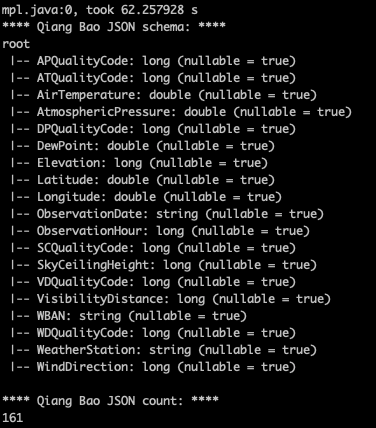
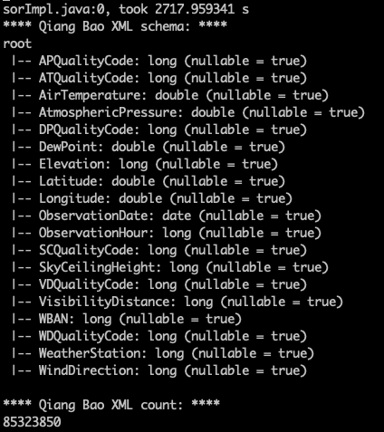
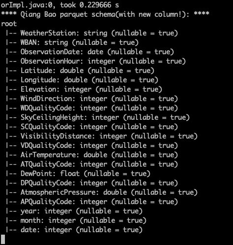

# ITMD-521 IT-D 872 Chapter-06 Lab

You will copy this template file to your own private GitHub repo provided.  Under your itmd-521 folder you will create a sub-folder named: **labs**.  Under that folder create a sub-folder named: **chapter-06**.  In that folder place this Readme.md

## Objectives

- Demonstrate creating dataframe from various file formats
- Demonstrate the advantages of "BigData" data types vs. conventional text based types
- Demonstrate the the application of compression and its advantages in dealing with large files

## Qiang Bao

### Lab

You will write one Spark application, in Java or Python that will work with the sample data provided from the NCDC for the assigned decade:  

- The application will include these steps, place a screenshot of the output under each item.  
- Include a single source code file and instructions in an **install.md** file.
- For the `SparkSession.builder.appName` use:
  - `HAWKID - lab chapter 06`
- A-K use 50/50.txt L-Z last name use 60/60.txt for your source file

## Schema and Partial Sample

```python
# This is a partial example to show you the schema of the NCDC dataset
# Though this is a partial Python example you can use Java as well -- your choice
# A-K use 50/50.txt L-Z lastname use 60/60.txt

df2 = spark.read.text("hdfs://namenode/user/controller/ncdc/raw/20/20.txt")

df2.withColumn('WeatherStation', df2['value'].substr(5, 6)) \
.withColumn('WBAN', df2['value'].substr(11, 5)) \
.withColumn('ObservationDate',to_date(df2['value'].substr(16,8), 'yyyyMMdd')) \
.withColumn('ObservationHour', df2['value'].substr(24, 4).cast(IntegerType())) \
.withColumn('Latitude', df2['value'].substr(29, 6).cast('float') / 1000) \
.withColumn('Longitude', df2['value'].substr(35, 7).cast('float') / 1000) \
.withColumn('Elevation', df2['value'].substr(47, 5).cast(IntegerType())) \
.withColumn('WindDirection', df2['value'].substr(61, 3).cast(IntegerType())) \
.withColumn('WDQualityCode', df2['value'].substr(64, 1).cast(IntegerType())) \
.withColumn('SkyCeilingHeight', df2['value'].substr(71, 5).cast(IntegerType())) \
.withColumn('SCQualityCode', df2['value'].substr(76, 1).cast(IntegerType())) \
.withColumn('VisibilityDistance', df2['value'].substr(79, 6).cast(IntegerType())) \
.withColumn('VDQualityCode', df2['value'].substr(86, 1).cast(IntegerType())) \
.withColumn('AirTemperature', df2['value'].substr(88, 5).cast('float') /10) \
.withColumn('ATQualityCode', df2['value'].substr(93, 1).cast(IntegerType())) \
.withColumn('DewPoint', df2['value'].substr(94, 5).cast('float')) \
.withColumn('DPQualityCode', df2['value'].substr(99, 1).cast(IntegerType())) \
.withColumn('AtmosphericPressure', df2['value'].substr(100, 5).cast('float')/ 10) \
.withColumn('APQualityCode', df2['value'].substr(105, 1).cast(IntegerType())) \
.drop('value').write.format("csv").mode("overwrite").option("header","true").save("hdfs://namenode/user/controller/output/your-hawk-id-here/20/")
```

- Parse the initially assigned text file
- Save this as a .csv uncompressed to the location: `.save("hdfs://namenode/user/controller/output/your-hawk-id-here/00/save-file-action")`  (00 is whichever dataset you were assigned to)
- Open the newly saved CSV file for reading again and print the schema and .count() values
  - Place screenshot

   

- Save the dataframe as a csv file compressed with snappy
- Open the newly saved compressed csv snappy file and print the schema and .count() values
  - Place screenshot

   
  
- Save the dataframe as a JSON uncompressed file
- Open the newly saved JSON file for reading again and print the schema and .count() values
  - Place screenshot

   

- Save the dataframe as a JSON file compressed with snappy
- Open the newly saved compressed JSON file and print the schema and .count() values
  - Place screenshot

   

- Save the dataframe as an XML file
- Open the newly saved XML file for reading again and print the schema and .count() values
  - Place screenshot

   

- Save the dataframe as a Parquet file
- Open the newly saved Parquet file for reading, create three additional columns splitting the
**ObservationDate** column into, **year**, **month**, **date** columns.
  - Print the schema
  - Place screenshot

   

### Notes

- [How to load and write xml files](http://www.thehadoopguy.com/2019/09/how-to-parse-xml-data-to-saprk-dataframe.html "How to load xml driver")
- [How to acquire the xml driver jar and use it](https://github.com/databricks/spark-xml "How to aquire the xml driver")

### Building Instructions

Place and instructions or assumptions needed to run your code in the `install.md` file

When running your jobs, you can background the jobs using the following syntax:

```bash

nohup spark-submit --master spark://namenode:7077 --driver-cores 1 --total-executor-cores 4 --num-executors 4  --driver-memory 4g --executor-memory 4g demo-read-write-json-compression-lz4.py &
```

### Deliverable

In your private repo push the Java or Python code you have written, any jars, the Readme.md and install.md document to the directory under your private GitHub repo: itmd-521 > labs > chapter-06.  

Submit the URL to this page to Blackboard as your deliverable.
