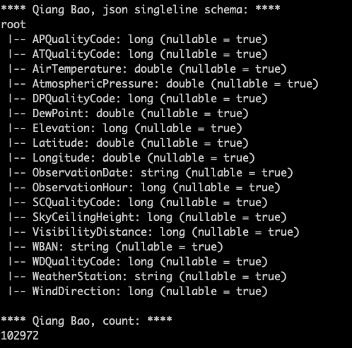
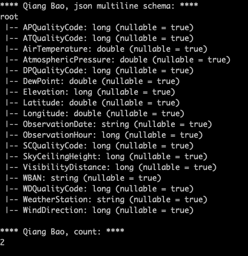
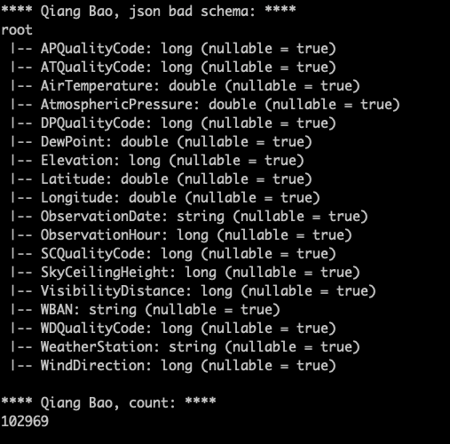
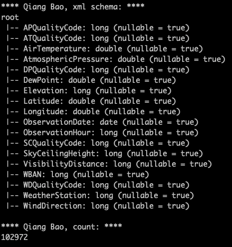
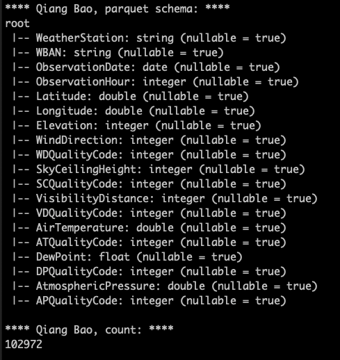
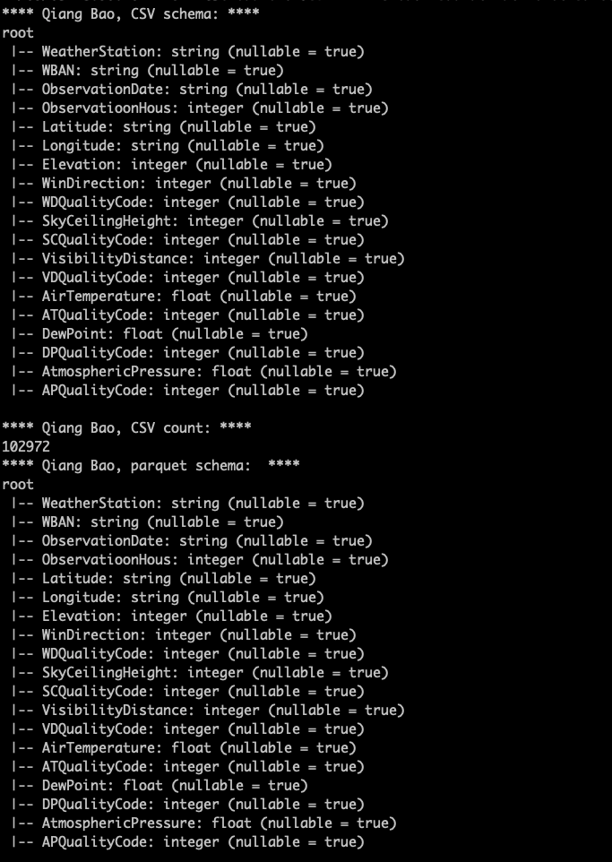
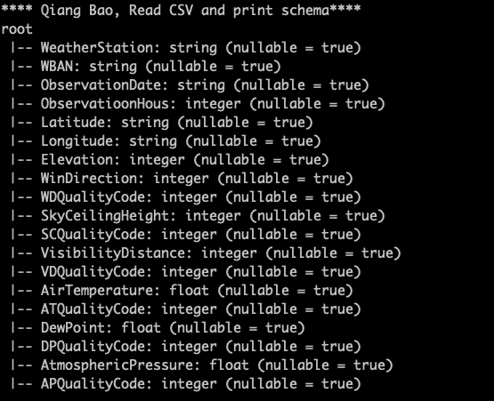
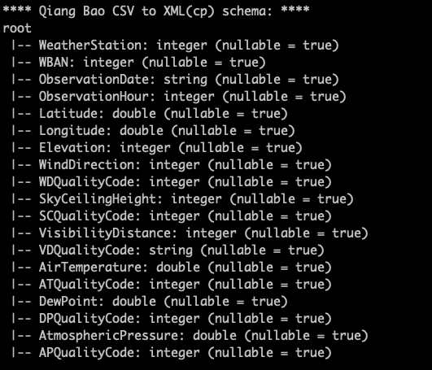
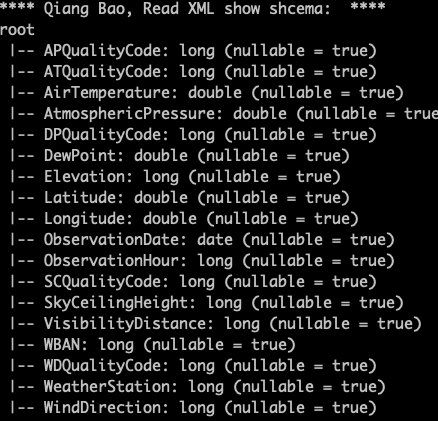

# ITMD-521 IT-D 872 Chapter-07 Lab

You will copy this template file to your own private GitHub repo provided.  Under your itmd-521 folder you will create a sub-folder named: **labs**.  Under that folder create a sub-folder named: **chapter-07**.  In that folder place this Readme.md

## Objectives

- Demonstrate creating dataframe from various file formats
- Demonstrate the advantages of "BigData" data types vs. conventional text based types
- Demonstrate the the application of compression and its advantages in dealing with large files

## Qiang Bao

### Lab

You will write one Spark application, in Java or Python that will work with the sample data provided from the NCDC for the decade of 1920s:  The application will include these steps, place a screenshot of the output under each item.

**Note:** include this line at the bottom of your .bashrc in the virtual machine: `export LD_LIBRARY_PATH=$HADOOP_HOME/lib/native` -- this is needed to enable Spark to use native compression libraries.

- Read CSV file
  - show number of records
  - show schema

   

- Read CSV file ncdc snappy compressed
  - show number of records
  - show schema

   

- Read Json file singleline
  - show number of records
  - show schema
  
   

- Read Json file multiline
  - show number of records
  - show schema

  

- Read Json file bad single line
  - show number of records
  - show schema

   

- Read Json file singleline compressed lz4
  - show number of records
  - show schema

  **** Something wrong with sample code ****

- Read Json file singleline compressed snappy
  - show number of records
  - show schema

  **** Something wrong with the sample code ****

- Read xml file
  - show number of records
  - show schema
  - [How to load and write xml files](http://www.thehadoopguy.com/2019/09/how-to-parse-xml-data-to-saprk-dataframe.html "How to load xml driver")
  - [How to acquire the xml driver jar and use it](https://github.com/databricks/spark-xml "How to aquire the xml driver")

   

- Read Parquet file
  - show number of records
  - show schema

   

- Read CSV file - create custom schema with correct datatype for date fields
  - show number of records
  - show schema
  - save as a new parquet file
  - Read the new parquet file and printSchema to show that the date field is now correctly interpreted

   

- Read CSV file - with a custom schema
  - print the schema
  - Save to JSON file (name: new-1920-ncdc.json)
  - Save to JSON file with snappy compression (name: new-1920-ncdc-snappy.json)

   

   

- Read CSV file save as XML file with compression
  - show number of records
  - show schema

   
   

- Read XML file
  - show schema
  - save as parquet
   

   

#### Building Instructions

Place and instructions or assumptions needed to run your code and repeat the results here

Execute instructions: spark-submit --packages com.databricks:spark-xml_2.12:0.12.0 ./ch07.py

### Deliverable

In your private repo push the single Java or Python file you have written, any jars and the Readme.md document to the directory under your private GitHub repo: itmd-521 > labs > chapter-07. 

Submit the URL to this page to Blackboard as your deliverable.
