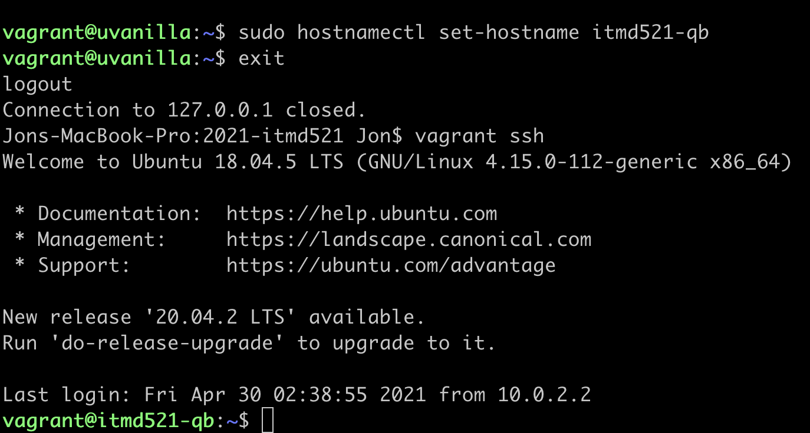
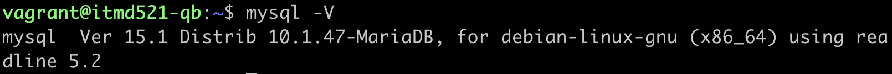
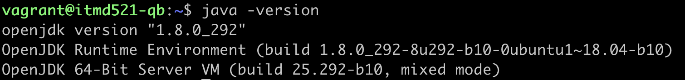
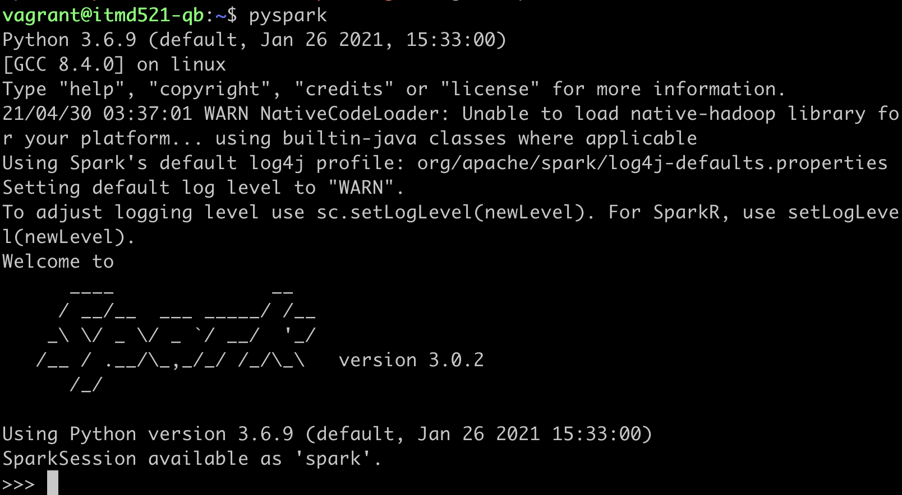
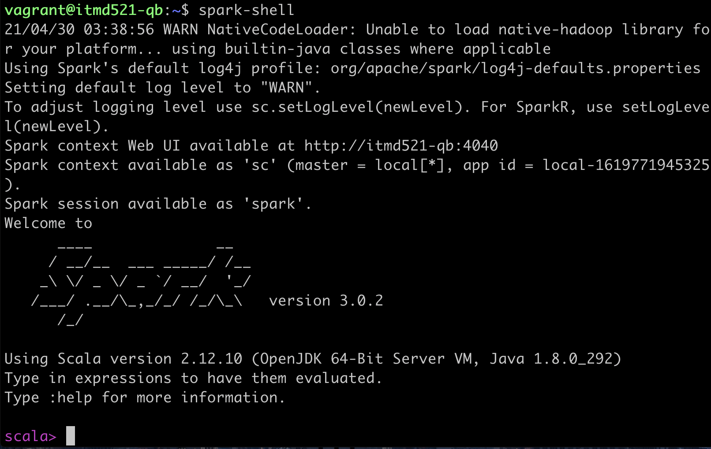
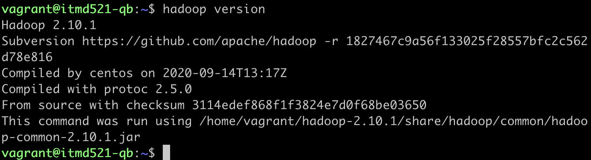
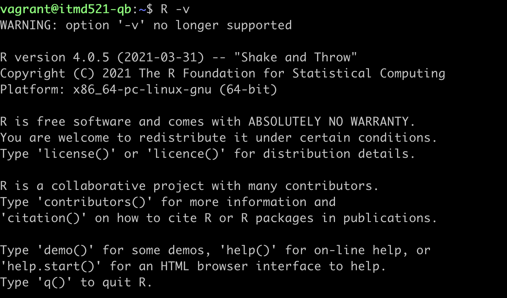
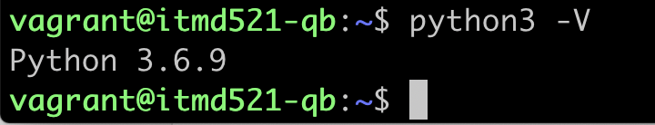

# Tooling Assignment Advanced Template

Provide the required screenshots to show that tooling has been properly installed

## Hostname

## MariaDB Version

Execute command: `mysql -V`

## Java Version

Execute command: `java -version`

## Spark Versions

Execute command: `pyspark` and `spark-shell` and take screenshots of each.

## Hadoop Version

Execute command: `hadoop version`

## R Version

Execute command: `R -v`

## Python Version

Execute command: `python -V`

## Result of Cloning Your Private Repository

No need to show the clone action -- just the results
Image goes here
